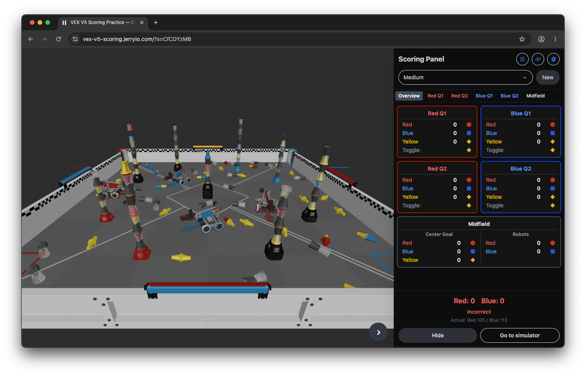

# VEX V5 Scoring Practice — Override

An interactive 3D web application for practicing [V5RC Override](https://link.vex.com/docs/26-27/v5rc/game-manual) (2026–2027) scoring. Examine randomly generated field setups in a 3D viewport, enter counts on the scoring panel similar to TM Mobile, and check your answer against the correct totals.

Practice solo or with other referees in **multiplayer** rooms where scoring and scenarios stay in sync. Like the companion [VEX IQ Scoring Practice — Level Up](https://github.com/Jerrylum/vex-iq-scoring-practice-level-up) project, this app is intended as a training tool for scorekeeper referees and anyone learning the Override scoring system. This project simplifies some edge cases for learning, but works well as a starting point for new scorekeeper referees preparing for Override events.

**Available at:** [vex-v5-scoring.jerryio.com](https://vex-v5-scoring.jerryio.com)



## How to Play

1. Select a difficulty level and click **New** to generate a random scenario.
2. Examine the 3D field. Count **visible pin halves** on each goal, note each quadrant's **toggle color**, and count **robots in the midfield**.
3. Use the scoring panel tabs to enter your counts. Red and blue alliance totals update automatically.
4. Click **Check** to verify your answer and see the correct counts per region.
5. Use the link button to copy a shareable URL so others can practice the same scenario.


## Scoring (2026–2027 Override)

Each **placed pin** can have zero, one, or two **scored halves**. Only **fully visible** halves count. End-of-match point values:


| Scoring item                                        | Points |
| --------------------------------------------------- | ------ |
| Each scored alliance-colored pin (red or blue half) | 5      |
| Each scored yellow pin (visible half, when owned)   | 10     |
| Each robot in the midfield                          | 8      |


**Yellow pin ownership** determines which alliance receives yellow points:

- In a **quadrant**, yellow pins score for the alliance whose color the toggle is set to. A neutral (yellow) toggle means yellow pins in that quadrant do not score.
- In the **midfield**, yellow pins score for the alliance with more robots in the midfield at end of match. If tied, yellow pins in the midfield do not score.

Alliance-colored halves always score for their respective alliances regardless of toggle status. Each alliance earns 8 points per robot in the midfield.

## Difficulty Levels


### Easy

- No robots on the field
- Simple midfield configuration (single yellow/yellow pin)
- Shorter quadrant stacks


### Medium

- All four robots placed on the field
- Varied midfield stacks (single pin or short stack)
- Medium-complexity quadrant stacks with cups


### Hard

- Robots on the field, including a clawbot that may occupy midfield space
- Tall midfield stacks
- Complex quadrant stacks with mixed pin types and edge cases


## Scenario Sharing

Each generated scenario uses a deterministic **master seed**. When you click the link button, the app copies a URL that encodes the seed, difficulty, and generator version. Opening that link on another device reproduces the same field layout and scoring answer key.

## Scope & Limitations

This practice app focuses on **end-of-match goal scoring** in generated scenarios. It does **not** currently include:

- Autonomous Bonus, Autonomous Win Points, or Autonomous Points
- Match Loads, preloads, or scoring objects elsewhere on the field
- Loaders, load zones, or toggles as interactive field elements beyond their set color
- Violations, disqualifications, or match-affecting rule edge cases
- Robot contact rules (SC2 assumes standard placed/visible status from final stack positions)

Cups are rendered in 3D stacks and affect which pin halves are visible, but the app does not simulate full match dynamics or object placement outside the generated goal regions.

For the official scoring rules, see the [V5RC Override Game Manual](https://link.vex.com/docs/26-27/v5rc/game-manual).

## Multiplayer

Practice scoring with other referees in a shared room (similar to Tournament Manager’s shared panel).

- **Create a room** from the main menu → Multiplayer. A room is created automatically (medium difficulty); share the link or QR code.
- **Join a room** by opening a link with `?roomId=…`.
- **Sync:** scoring, scenario, and show-answer state broadcast to all clients. Edits are debounced; reconnect re-joins the room after a transport drop.
- **View presets:** use the pause menu (Esc) to switch local camera angles (Head Ref, SW/SE scorekeeper, Observer). View choice is per-tab only and is not synced.


### Multiplayer development

Run the web app and Cloudflare Worker together:

```bash
bun run dev:all
```

- Web: `http://localhost:5173`
- Worker WebSocket: `ws://localhost:8787/ws`

Regenerate Worker types after changing `wrangler.jsonc`:

```bash
cd apps/worker && bun run cf-typegen
```


## Getting Started


### Prerequisites

- [Bun](https://bun.sh) v1.0 or higher


### Installation

```bash
# Install dependencies
bun install
```


### Development

```bash
# Start development server
bun run dev
```

Visit `http://localhost:5173` to see the application.

### Build

```bash
# Build for production
bun run build

# Preview production build
bun run preview
```


### Deploy

```bash
bun run deploy
```


### Tests

```bash
bun run test
```


### Code Formatting

```bash
# Format code with Prettier
bun run format
```


## Keyboard & Mouse Controls


### 3D Viewport

- **Left Click + Drag**: Rotate camera
- **Right Click + Drag**: Pan camera
- **Scroll Wheel**: Zoom in/out
- **Touch**: Pinch to zoom, drag to rotate


### Scoring Panel

- **Desktop**: Click arrow button on the left to collapse/expand
- **Mobile**: Tap the floating menu button to open the panel


## Browser Support

- Chrome/Edge 90+
- Firefox 88+
- Safari 14+
- Mobile browsers with WebGL support


## Contributing

This is a practice/educational project. Feel free to fork and modify for your own use.

## License

This project is licensed under the GNU General Public License v3.0 (GPLv3). See the [LICENSE](LICENSE) file for details.

VEX and VEX V5 are trademarks of Innovation First International, Inc. This project is for educational purposes.